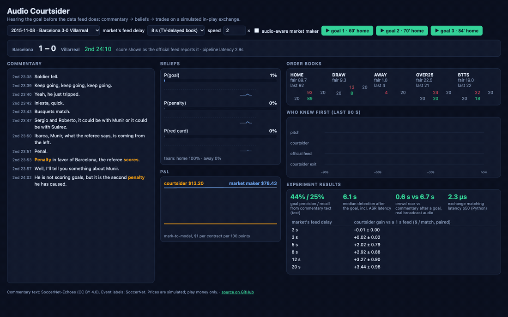
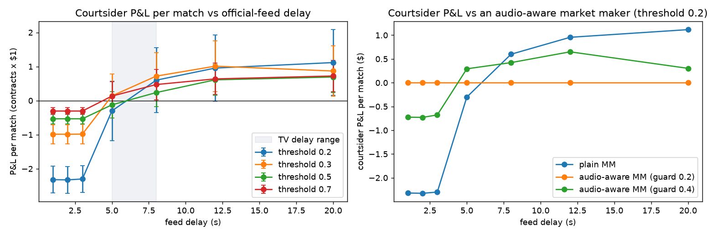
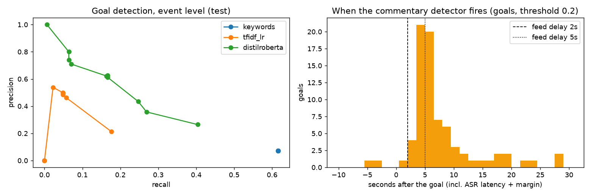

# Audio Courtsider

**Hearing the goal before the data feed does.** A real-time system that listens to soccer
commentary, works out what just happened on the pitch, and trades on that head start in a
simulated in-play exchange — then measures how much the edge is worth and whether a market maker
can defend against it.

**[▶ Live demo](https://srishti-h.github.io/audio-courtsider/)**: replay real goals in the browser and flip the
market's feed delay to watch the edge appear or vanish.



## Results

All numbers are on held-out data: SoccerNet **test** split (92 matches with commentary, 75 with
odds for trading). Thresholds and model choices were made on the validation split.

**1. Commentary is worth money only against a slow market.** A courtsider that hears the
commentary trades against a market maker who reprices on the official feed. Its P&L per match
(paired across the same 75 matches, relative to a 1 s feed):

| market's feed delay behind the pitch | 2 s | 3 s | 5 s | 8 s | 12 s | 20 s |
|---|---|---|---|---|---|---|
| courtsider gain ($ / match) | −0.01 ± 0.00 | +0.02 ± 0.02 | **+2.02 ± 0.79** | **+2.92 ± 0.88** | **+3.27 ± 0.90** | **+3.44 ± 0.96** |

Against a fast (≤3 s) data feed the courtsider *loses* $2.32 ± 0.39 per match: by the time
commentary confirms a goal the price has already moved, and false alarms cost the spread. The
edge switches on at ~5 s, i.e. against books priced off TV pictures (5–8 s behind) or streams.



**2. A market maker can defend cheaply, but the bigger threat is the TV.** If the market maker
runs the same commentary detector and pulls quotes when P(event) ≥ 0.4, it cuts its losses to
the courtsider by $0.50–0.98 per match at a cost of only $0.15–0.21 of spread revenue; at 0.2 it
shuts the courtsider out entirely for $0.53–0.57. For comparison, once its feed is slower than TV
viewers (7 s), slow-but-informed TV traders cost it **$46 ± 4 per match**.

**3. Detecting events from (noisy, mostly machine-translated) commentary text** — event level,
test split, with measured ASR latency (1.83 s) and a conservative 1.05 s timestamp margin added:

| event | n | precision | recall | median time after the event |
|---|---|---|---|---|
| goal | 312 | 0.44 | 0.25 | 6.1 s |
| yellow card | 397 | 0.49 | 0.60 | 5.0 s |
| offside | 389 | 0.56 | 0.51 | 6.0 s |
| corner | 927 | 0.39 | 0.41 | 3.8 s |
| substitution | 533 | 0.34 | 0.44 | 2.7 s |
| penalty | 37 | 0.12 | 0.08 | 4.3 s |

For goals, the fine-tuned DistilRoBERTa beats TF-IDF + LR (P 0.21 / R 0.18) and keyword rules
(P 0.07 / R 0.62: "goal" is said all the time) and its isotonic-calibrated probabilities are
well calibrated (ECE 0.001 vs 0.033 raw). An HMM filter trades precision for recall (P 0.13 / R
0.52). Team attribution on confident goal calls: 62.5 %. Red cards (21 in test) remain unsolved.



**4. Streaming speech recognition on an M5 Pro** (synthetic commentary audio — real Echoes text
re-voiced over a synthetic crowd; 16 clips, 24 min):

| Whisper | team-sheet biasing | WER | player-name recall | median word latency | real-time factor |
|---|---|---|---|---|---|
| tiny | – | 0.65 | 0.27 | 1.8 s | 0.08 |
| base | – | 0.59 | 0.28 | 1.9 s | 0.15 |
| small | – | 0.32 | 0.37 | 2.4 s | 0.22 |
| **small** | **✓** | **0.25** | **0.73** | **2.1 s** | 0.20 |
| large-v3-turbo | ✓ | 0.44 | 0.73 | 2.5 s | 0.79 |

Biasing the decoder with names mined from the match doubles player-name recall. Turbo runs near
real time, so its lag spikes (p99 15 s); `small` + biasing is the operating point. Crowd-roar
onsets, when they fire, land 0.5 s after the goal vs ~4.6 s for the transcript path (33 % recall,
synthetic crowd).

**5. On real broadcast audio, end to end** (5 test matches with English commentary, 458 min,
30 goals; SoccerNet videos under NDA, streamed through Whisper `small` + name biasing, the text
model and the crowd detector):

| signal | goals caught | median time after the goal | false alarms |
|---|---|---|---|
| commentary text (P ≥ 0.5) | 27 % | 6.7 s | 0.05 / min (≈ 4 per match) |
| crowd roar (CUSUM) | 23 % | **0.6 s** | 0.22 / min (≈ 19 per match) |
| either | 43 % | | |

Live speech-to-text on broadcast audio delivers a commentary segment 2.4 s after it is spoken at
0.39× real time. The text path's timing on real audio (27 % at 6.7 s) matches the transcript-based
estimate above (25 % at 6.1 s), which supports the offline methodology; the crowd reacts an order
of magnitude faster than the words, but is noisy on its own.

**6. Pricing and plumbing.** Dixon–Coles fit only on earlier matches gets a 1X2 log loss of 0.989
on 5,478 matches, closing 73 % of the gap between base rates (1.063) and Pinnacle closing odds
(0.962); in-play Brier falls from 0.50 at kick-off to 0.14 at 85'. The pure-Python matching
engine handles 350 k msgs/s (p50 2.3 µs, p99 7.8 µs); the text classifier scores a segment in
3.4 ms on MPS; acoustic features cost 11 ms per second of audio.

## How it works

```
 commentary audio ──► streaming Whisper (mlx, LocalAgreement-2, team-sheet biasing) ─┐
        │                                                                               ├─► text event extractor ──► calibration / fusion ──► P(goal | team), P(penalty), P(red)
        └──► crowd-roar CUSUM + commentator excitement (pitch, loudness) ─────────────┘                                                    │
                                                                                                                                             ▼
 SoccerNet true events ──► official feed (t + delay) ──► Dixon–Coles in-play pricer ──► market maker  ◄──── courtsider bot (trades the gap)
                                                                                              │                     ▲
                                                             noise traders, TV-delay traders ─┴──► EXCHANGE ◄───────┘
                                                                         (price-time order book, risk checks, journal)
```

| Stage | What | Key ideas |
|---|---|---|
| **Data** (`data/`) | 500 SoccerNet matches: 110k timestamped events, 714k commentary segments (464 matches with English text), 5.5k matches of results + closing odds | event labels and commentary share the broadcast timeline, so text can be supervised by *when* things happened |
| **Speech** (`asr/`) | streaming Whisper on Apple silicon | re-transcribe a sliding buffer every second and commit only words two passes agree on; temperature fallback + n-gram loop removal against Whisper hallucinations; player names mined from the match commentary as a proxy team sheet to bias decoding |
| **Acoustics** (`acoustic/`) | crowd roar and commentator excitement | strictly causal DSP: high-band energy z-scored against a trailing median/MAD baseline with a leaky one-sided CUSUM; YIN pitch + loudness z-scores |
| **Language** (`text/`) | what event is the commentator describing, and for which team | keyword rules → TF-IDF + logistic regression → fine-tuned DistilRoBERTa with a multi-label event head and a team head; inputs carry only *past* context |
| **Fusion** (`fusion/`) | turn per-segment scores into calibrated beliefs over time | isotonic calibration, a 2-state HMM forward filter, and a GRU; chosen on validation by event-level F1 |
| **Pricing** (`pricing/`) | fair value of HOME / DRAW / AWAY / OVER 2.5 / BTTS | time-decayed Dixon–Coles fit only on earlier matches; in-play remaining-goal Poisson using the empirical goal-time curve, red-card multipliers, penalty mixture |
| **Exchange** (`exchange/`) | where the edge is realised | price-time-priority book on integer ticks, IOC/GTC, cancel/reduce, self-trade prevention, position limits, kill switch, settlement; every message is sequenced and journaled so a replay reproduces the exact state hash; sequenced market-data deltas with gap detection |
| **Simulation** (`sim/`) | who knows what, when | event-driven: pitch truth → official feed (+delay) → TV (+7 s) vs commentary detector (+ASR latency); market maker, noise traders, slow informed traders and the courtsider; markouts split MM P&L into spread capture vs adverse selection |
| **Dashboard** (`api/`, `web/`) | watch it happen | FastAPI streams a deterministic simulation over a WebSocket to a React app: transcript, belief meters, five order books, a "who knew first" timeline and P&L |

## Honest limitations

* **Timing on real commentary comes from offline transcripts.** SoccerNet-Echoes timestamps are
  Whisper *segment* times, not live word times, and drift a few seconds against the video
  labels. Every lead-time number therefore adds (a) the streaming latency measured on audio and
  (b) a conservative margin estimated on training matches so the courtsider is almost never
  credited with hearing a goal before it happened.
* **The ASR model comparison (table 4) uses synthetic audio**: real commentary text re-voiced with
  macOS TTS over a synthetic crowd, because word error rate needs an exact reference script.
  The end-to-end real-audio check (table 5) covers 5 matches / 30 goals, so its rates are rough.
* **The commentary is mostly machine-translated** (Whisper's translate task) from Spanish,
  French, German, Russian and others; native English commentary would be easier.
* **Team attribution from text is hard** without a team sheet that maps players to teams. The
  courtsider weights the home/away scenarios by the team head's probabilities, so team-agnostic
  contracts such as OVER 2.5 carry the cleanest part of the signal.
* **Liquidity and behaviour are simulated.** One market maker, Poisson noise traders and a fixed
  latency ordering (MM 50 ms, courtsider 100 ms). P&L is play money and indicates the *size* of
  an information edge, not a trading strategy.

## Reproduce

Requires an Apple-silicon Mac for mlx-whisper (everything else runs anywhere), Python 3.12 with
[uv](https://docs.astral.sh/uv/), and Node 20+.

```bash
make setup     # uv sync + npm install
make data      # download SoccerNet labels, Echoes transcripts, football-data odds (~600 MB)
make train     # text event extractors (~45 min on an M-series GPU)
make eval      # pricing, audio, text, market and latency experiments -> results/
make test      # unit + property-based tests
make serve     # API on :8000   (in another terminal: make web  ->  http://localhost:5173)
```

Replays are shareable: `http://localhost:5173/?game=<game_id>&start=<seconds>&feed_delay=8&autoplay=1`.

## Layout

```
src/courtsider/
  data/       loaders + table builder (SoccerNet, Echoes, football-data)
  text/       weak labels, keyword / TF-IDF / transformer extractors, training
  asr/        streaming Whisper, segmenter, name mining, WER
  acoustic/   crowd-roar and excitement detectors
  synth/      synthetic commentary audio
  fusion/     calibration, HMM filter, GRU
  pricing/    Dixon–Coles, in-play pricer
  exchange/   order book, matching engine, market-data mirror
  sim/        match simulation, agents
  eval/       experiments (run_pricing, run_audio, run_text, run_market, run_bench, run_real_audio)
  api/        FastAPI + WebSocket replay
web/          React + TypeScript dashboard
tests/        exchange property tests (Hypothesis), pricing and simulation tests
results/      experiment outputs and figures
```

## Data and credits

SoccerNet action-spotting labels ([soccer-net.org](https://www.soccer-net.org/)),
SoccerNet-Echoes commentary transcripts (Gautam et al., 2024, CC BY 4.0), and
[football-data.co.uk](https://www.football-data.co.uk/) results and odds. Streaming policy after
Macháček et al. (2023), *Turning Whisper into Real-Time Transcription System*; pricing after
Dixon & Coles (1997). No audio, video or transcripts are redistributed in this repository.
